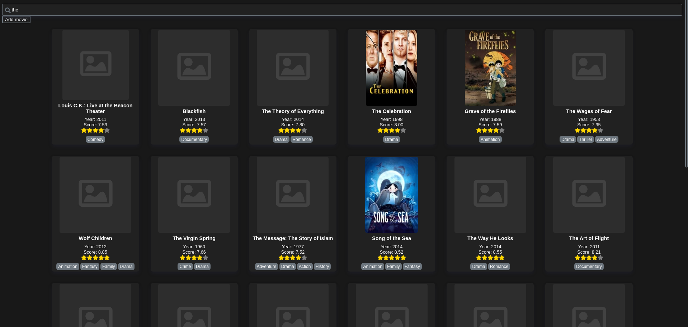

# Full-stack application example

**Check out my other repositories**:

- [Domain-Driven Hexagon](https://github.com/Sairyss/domain-driven-hexagon) - Guide on Domain-Driven Design, software architecture, design patterns, best practices etc.
- [Distributed systems topics](https://github.com/Sairyss/distributed-systems-topics) list of topics and resources related to distributed systems, system design, microservices, scalability and performance, etc
- [Backend best practices](https://github.com/Sairyss/backend-best-practices) - Best practices, tools and guidelines for backend development.

---

This is an example of a simple full-stack application that integrates with an external API.

The Application is a web app for searching movies. You can also add new movies that will be saved to a database and indexed in an external search engine.

This can be a good example for people who are trying to learn how to structure a full-stack application of a low-medium complexity.

Code examples cover things like testing, documentation, integration with external APIs, working with a database, configs and environmental variables, easy application setup, project folder/file structure etc.

**Note**: this repo is a work in progress, frontend is a bit messy and unfinished. Backend is mostly finished. Keep in mind that this is just an example app and it is not perfect.

Tech used:

- [NodeJS](https://nodejs.org/en/) backend with [NestJS](https://nestjs.com/) framework
- [MongoDB](https://www.mongodb.com/) database with [mongoose](https://www.npmjs.com/package/mongoose) package
- [React](https://reactjs.org/) frontend, [SASS/SCSS](https://sass-lang.com/) for styles
- [Algolia search engine](https://www.algolia.com/) as external indexing API
- [OpenAPI/Swagger](https://swagger.io/) for documentation
- [Nx](https://nx.dev/) monorepo

## Running the application

**Note**: You must have docker installed and running before continuing.

- `npm run setup` - setups the application (installs dependencies, docker images, creates .env files).
- Sign up in Algolia Developer hub <https://www.algolia.com/developers/> and set your Algolia API keys in `.env` and `.env.test` files.
- `npm run docker:env` - run docker environment (starts mongodb)
- `npm run seed:dev` - seed database and index with some dummy data (docker environment must be running and api keys must be set in `.env` )
- `npm run start:dev` - starts api and client

- Client web application will be available at <http://localhost:4200>
- API endpoints will be available at <http://localhost:3333/api/v1/movies>

## Other

- <http://localhost:3333/docs/> - open in browser to see api documentation (api must be running)
- `npm run test:api` - run tests for api (docker environment must be running)
- `npm run test:client` - run tests for client
- `npm run dep-graph` - see dependency graph

#### Pending to do (mostly frontend):

- Confirm dialog on movie deletion
- Optimistic updates when a movie is created
- Add query to URL when searching
- Add tests to frontend (unit and cypress)
- Polish UI/UX, refactor messy code, fix minor bugs

Feel free to contribute and improve code if you like.
